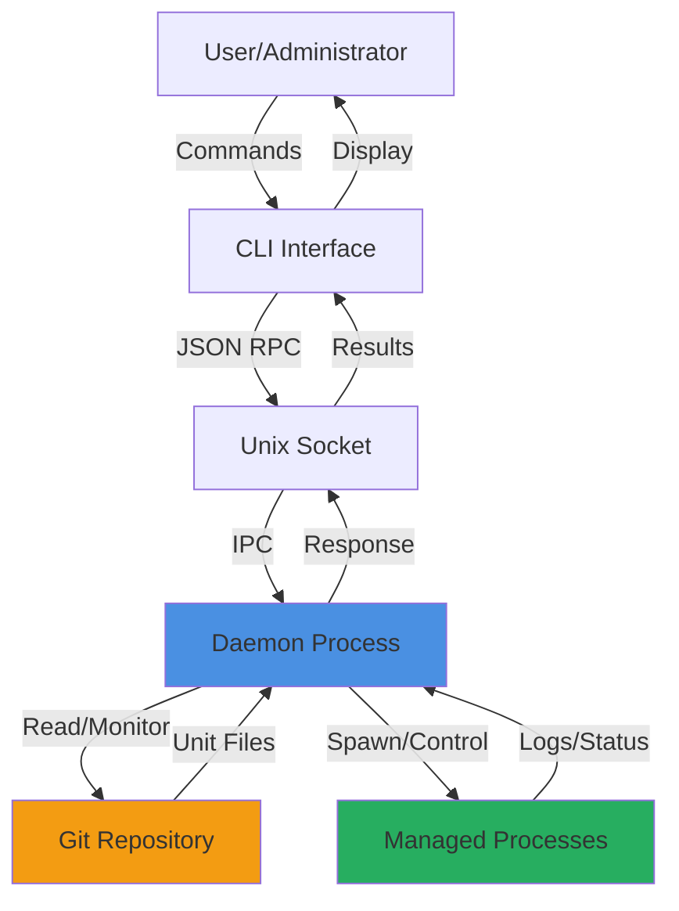
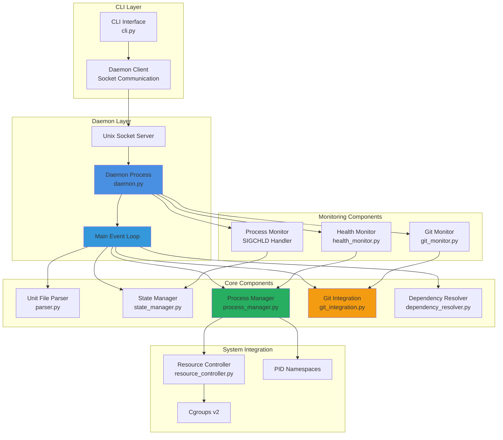
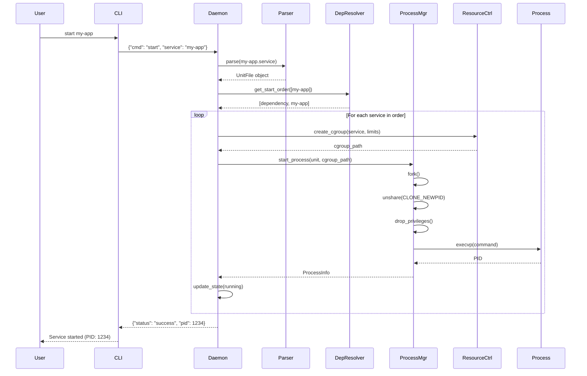
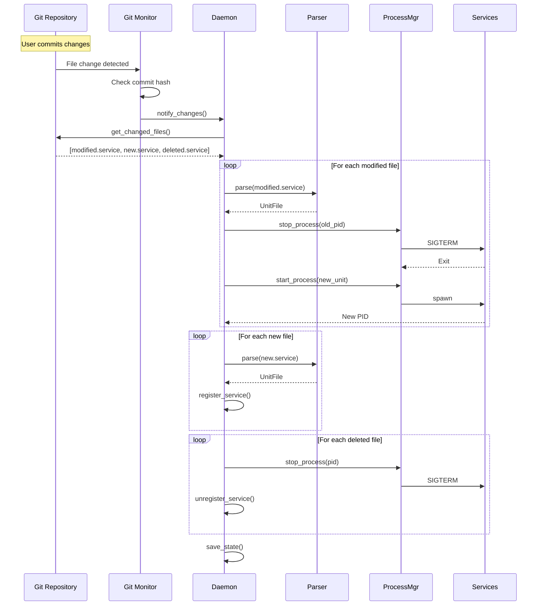
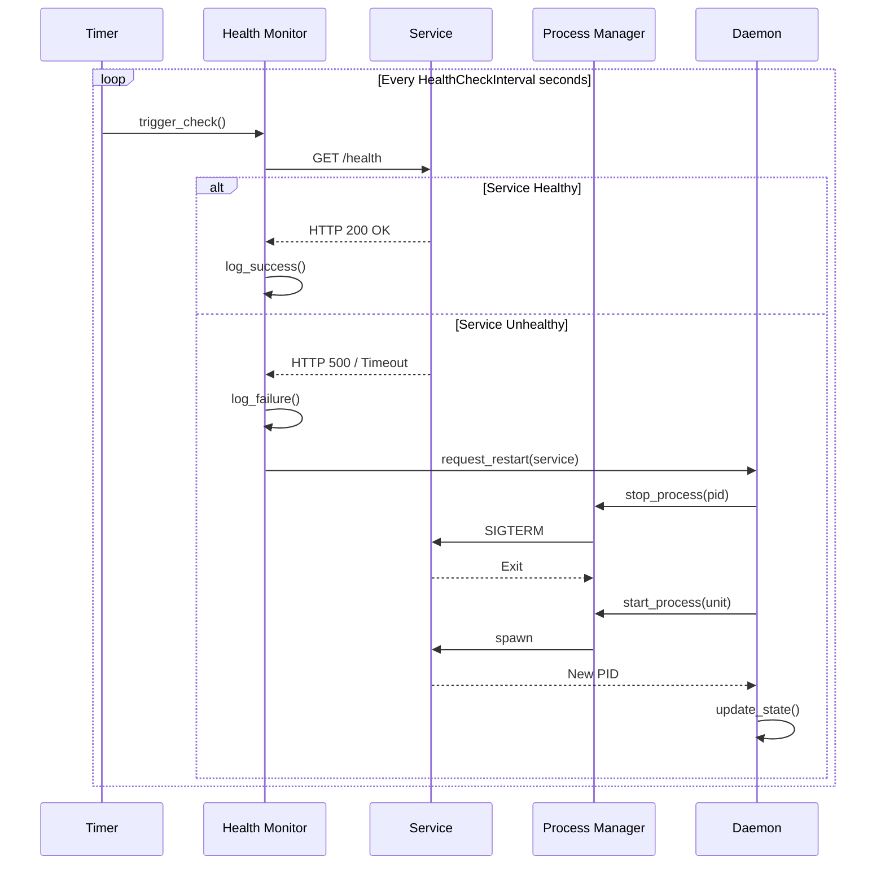
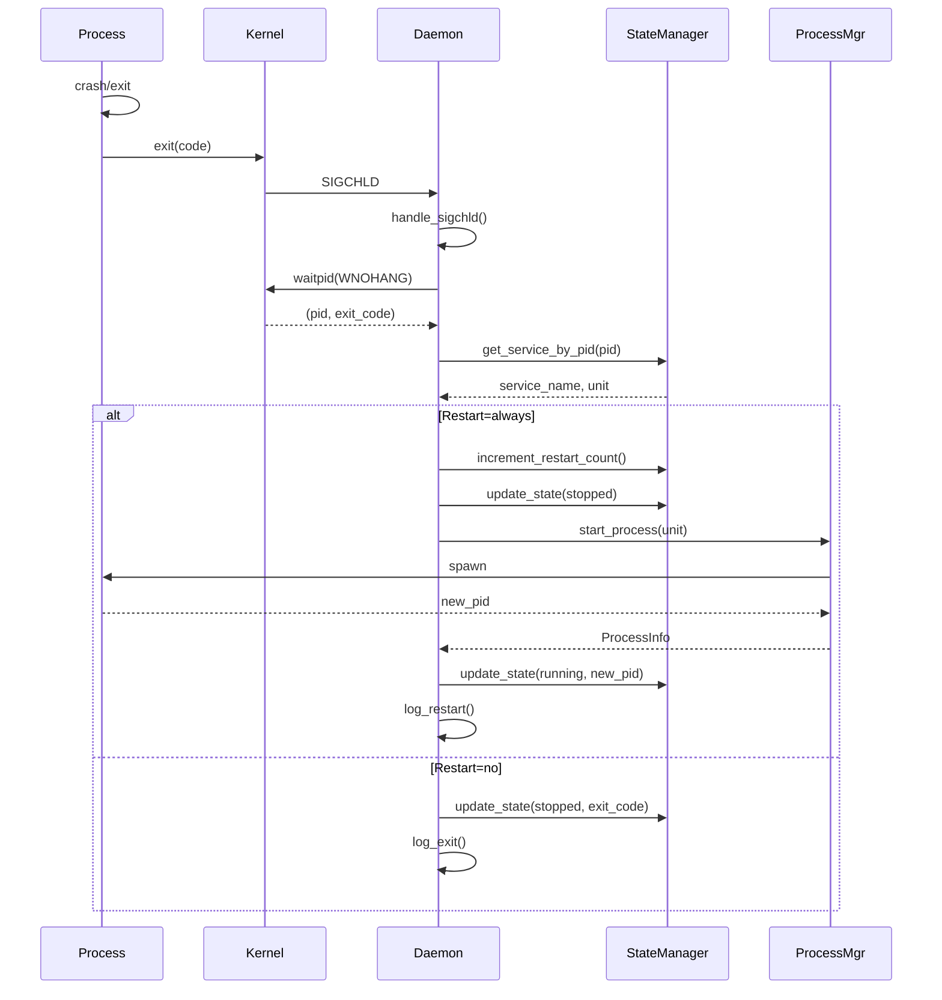

# GitProc Architecture

This document provides a detailed overview of the GitProc system architecture, component interactions, and data flow.

## System Overview

GitProc is a Git-backed process manager that combines version control with service management. The system consists of a CLI interface, a daemon process, and several core components that work together to manage service lifecycles.

## High-Level Architecture



## Component Architecture



## Data Flow Diagrams

### Service Start Flow



### Git Sync Flow



### Health Check Flow



### Process Restart Flow



## Component Details

### CLI Interface (cli.py)

**Responsibilities:**
- Parse command-line arguments
- Connect to daemon via Unix socket
- Send JSON-encoded commands
- Display formatted responses
- Handle connection errors

**Key Classes:**
- `CLI`: Main CLI handler
- `DaemonClient`: Socket communication wrapper

### Daemon Process (daemon.py)

**Responsibilities:**
- Main event loop coordination
- Unix socket server for CLI communication
- Signal handling (SIGTERM, SIGCHLD)
- Service lifecycle orchestration
- State persistence

**Key Classes:**
- `Daemon`: Main daemon controller
- `UnixSocketServer`: IPC server

**Threads:**
- Main thread: Event loop and socket server
- Git monitor thread: Repository change detection
- Health check thread: Periodic health checks

### Unit File Parser (parser.py)

**Responsibilities:**
- Parse .service files (INI format)
- Extract service directives
- Validate configuration
- Convert units (memory, CPU)

**Key Classes:**
- `UnitFile`: Service configuration dataclass
- `UnitFileParser`: Parser and validator

### Process Manager (process_manager.py)

**Responsibilities:**
- Process spawning with isolation
- Signal handling (SIGTERM, SIGKILL)
- Output capture and logging
- Privilege dropping
- Cgroup integration

**Key Classes:**
- `ProcessManager`: Process lifecycle controller
- `ProcessInfo`: Process metadata

**Isolation Features:**
- PID namespace (Linux)
- User/group switching
- Environment isolation
- Resource limits via cgroups

### Git Integration (git_integration.py)

**Responsibilities:**
- Repository initialization
- Unit file discovery
- Change detection
- Rollback operations
- Branch management

**Key Classes:**
- `GitIntegration`: Git operations wrapper

**Dependencies:**
- GitPython library

### State Manager (state_manager.py)

**Responsibilities:**
- Service registry
- State tracking (running/stopped/failed)
- Persistent storage
- State queries

**Key Classes:**
- `ServiceState`: Service state dataclass
- `StateManager`: State controller

**Storage:**
- In-memory: Dict[service_name, ServiceState]
- Persistent: JSON file with atomic writes

### Resource Controller (resource_controller.py)

**Responsibilities:**
- Cgroup creation and management
- Memory limit enforcement
- CPU quota configuration
- Process assignment to cgroups

**Key Classes:**
- `ResourceController`: Cgroup manager

**Cgroup Support:**
- Cgroups v2 (preferred)
- Cgroups v1 (fallback)
- Graceful degradation if unavailable

### Dependency Resolver (dependency_resolver.py)

**Responsibilities:**
- Build dependency graph
- Topological sorting
- Cycle detection
- Start order calculation

**Key Classes:**
- `DependencyResolver`: Dependency graph manager

**Algorithm:**
- Kahn's algorithm for topological sort
- DFS for cycle detection

### Health Monitor (health_monitor.py)

**Responsibilities:**
- Periodic health checks
- HTTP endpoint monitoring
- Failure detection
- Restart triggering

**Key Classes:**
- `HealthMonitor`: Health check coordinator
- `HealthCheck`: Check configuration

**Check Types:**
- HTTP GET requests
- Timeout handling (5 seconds)
- Status code validation (200 = healthy)

### Git Monitor (git_monitor.py)

**Responsibilities:**
- File system monitoring
- Commit detection
- Change notification

**Key Classes:**
- `GitMonitor`: Repository watcher

**Implementation:**
- Watchdog library for file events
- Monitor .git/refs/heads/<branch>
- Fallback to polling if inotify unavailable

## Directory Structure

```
/etc/gitproc/
├── services/              # Git repository
│   ├── .git/             # Git metadata
│   ├── app.service       # Service unit files
│   ├── nginx.service
│   └── database.service
└── config.json           # Configuration

/var/lib/gitproc/
└── state.json            # Persistent state

/var/log/gitproc/
├── daemon.log            # Daemon logs
├── app.log               # Service logs
├── nginx.log
└── database.log

/var/run/
└── gitproc.sock          # Unix socket

/sys/fs/cgroup/gitproc/   # Cgroups
├── app/
│   ├── memory.max
│   ├── cpu.max
│   └── cgroup.procs
└── nginx/
    ├── memory.max
    ├── cpu.max
    └── cgroup.procs
```

## Communication Protocols

### CLI ↔ Daemon (Unix Socket)

**Protocol:** JSON-RPC over Unix domain socket

**Request Format:**
```json
{
  "command": "start|stop|restart|status|logs|list|rollback|sync",
  "service": "service-name",
  "args": {
    "follow": true,
    "lines": 100,
    "commit": "abc123"
  }
}
```

**Response Format:**
```json
{
  "status": "success|error",
  "data": {
    "pid": 1234,
    "state": "running",
    "logs": "..."
  },
  "error": "error message if status=error"
}
```

### Daemon ↔ Services

**Process Control:**
- SIGTERM: Graceful shutdown request
- SIGKILL: Forced termination (after timeout)
- SIGCHLD: Process exit notification

**Output Capture:**
- stdout/stderr redirected to log files
- File descriptors duplicated with dup2()

## Security Model

### Privilege Separation

```
┌─────────────────────────────────────┐
│         Daemon (root)                │
│  - Namespace creation                │
│  - Cgroup management                 │
│  - Privilege dropping                │
└──────────────┬──────────────────────┘
               │
               ├─────────────────────────┐
               │                         │
               ▼                         ▼
    ┌──────────────────┐    ┌──────────────────┐
    │  Service A       │    │  Service B       │
    │  (user: nobody)  │    │  (user: appuser) │
    │  - No root       │    │  - No root       │
    │  - Isolated PID  │    │  - Isolated PID  │
    │  - Resource lim  │    │  - Resource lim  │
    └──────────────────┘    └──────────────────┘
```

### Isolation Layers

1. **PID Namespace**: Process cannot see other system processes
2. **User Separation**: Services run as non-root users
3. **Resource Limits**: Cgroups prevent resource exhaustion
4. **File System**: Services inherit daemon's file system view

## Performance Considerations

### Event-Driven Architecture

- Non-blocking I/O for socket communication
- Signal-driven process monitoring (SIGCHLD)
- File system events for Git monitoring (inotify)
- Thread pool for health checks

### Resource Usage

**Daemon:**
- Memory: ~20-50 MB baseline
- CPU: <1% idle, <5% during operations
- File descriptors: 3 + (2 × number of services)

**Per Service:**
- Memory: Service-dependent + ~1 MB overhead
- CPU: Service-dependent
- File descriptors: 3 (stdin/stdout/stderr) + service usage

### Scalability

- Tested with 100+ concurrent services
- Linear memory growth with service count
- Constant CPU usage (event-driven)
- Git operations scale with repository size

## Error Handling Strategy

### Graceful Degradation

```
Feature Available? → Use Feature
       ↓ No
   Log Warning
       ↓
   Continue Without Feature
       ↓
   Provide Reduced Functionality
```

**Examples:**
- No PID namespace support → Run without isolation
- No cgroups → Run without resource limits
- Git operation fails → Continue with last known state
- Health check fails → Log and retry

### Error Recovery

- Automatic restart on service crash (if configured)
- State persistence across daemon restarts
- Rollback capability for bad configurations
- Detailed error logging for troubleshooting

## Future Architecture Considerations

### Potential Enhancements

1. **Distributed Management**
   - Git push/pull for multi-node synchronization
   - Shared state via distributed database
   - Leader election for coordination

2. **Additional Isolation**
   - Network namespaces
   - Mount namespaces
   - Seccomp profiles

3. **Advanced Monitoring**
   - Metrics collection (Prometheus)
   - Distributed tracing
   - Performance profiling

4. **High Availability**
   - Daemon redundancy
   - Automatic failover
   - Service migration

## References

- [Linux Namespaces](https://man7.org/linux/man-pages/man7/namespaces.7.html)
- [Cgroups v2](https://www.kernel.org/doc/html/latest/admin-guide/cgroup-v2.html)
- [systemd Unit Files](https://www.freedesktop.org/software/systemd/man/systemd.service.html)
- [Git Internals](https://git-scm.com/book/en/v2/Git-Internals-Plumbing-and-Porcelain)
